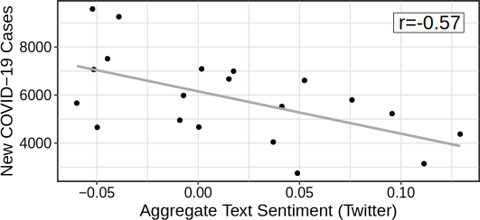

```{r xaringan-themer, include=FALSE, warning=FALSE}
#This block contains the theme configuration for the CSS lab slides style
library(xaringanthemer)
library(showtext)
style_mono_accent(
  base_color = "#5c5c5c",
  text_font_size = "1.5rem",
  header_font_google = google_font("Arial"),
  text_font_google   = google_font("Arial", "300", "300i"),
  code_font_google   = google_font("Fira Mono")
)
```

```{r setup, include=FALSE}
options(htmltools.dir.version = FALSE)
```


layout: true
<div class="my-footer"><span>David Garcia - Social Data Science Lab - University of Konstanz</span></div> 

---
# Outline

## 1. Analyzing collective emotions with social media data

## 2. Validating social media macroscopes of emotions

---

## The Social Function of Collective Emotions

<center>
```{r, echo=FALSE, out.width=900}
knitr::include_graphics("figures/ColectiveEmotions.png")
```
</center>

- **Theory of collective effervescence (Durkheim, 1912):**
Shared emotions generate social identity, reinforce shared beliefs, and lead to higher solidarity

- **Collective emotions (von Scheve and Salmela, 2014):**   
Emotional states shared by a large amount of people at the same time


---

background-size: 40%
background-image: url(figures/Trauma.png)
background-position: 90% 60%


## Emotional Responses to Collective Traumas

**How do societies respond to traumatic events?**  
**Is there a social function of collective emotions?**
.pull-left[
- Emotional synchronization: Experience of simultaneous negative emotions

- Collective emotion lasts longer than individual emotional reactions

- Individuals that participate in the collective emotions show higher levels of long-term solidarity ]

---

## Twitter Digital Traces after a Terrorist Attack

Focus on Paris Attacks of of Nov 13, 2015  
Removed bots, news media, and organizations. Final sample of 62,114 users  
Retrieved historical timeline of users. Total of more than 27 Million tweets (no RT)
<center>
```{r, echo=FALSE, out.width=900}
knitr::include_graphics("figures/ParisCase.png")
```

---

## Linguistic Signals

**Linguistic Inquiry and Word Count, LIWC (pronounced “Luke”)**  
- Simple word matching method  
- Validated by psychologists, years of implementation (2001-2015)  
- Multiple classes, calibrated for netspeak and neologisms


.pull-left[
```{r, echo=FALSE, out.width=1000}
knitr::include_graphics("figures/LIWC.png")
```
]
.pull-right[
**LIWC classes in this study:**  
Positive Affect, Negative Affect  
Anxiety, Sadness, Anger  
Social processes  
Prosocial terms (Frimer, et. al, 2014)  
French values (libert*, egalit*, fraternit*)
]

---

## Agent-Based Modelling of Collective Emotions

.pull-left[
```{r, echo=FALSE, out.width=1000}
knitr::include_graphics("figures/Framework.png")
```

ABM calibrated with experiment data
- φ: post-shock AR(1) term
- φ~0: subcritical response
- φ>0: critical, collective behavior
]

.pull-right[
```{r, echo=FALSE, out.width=450}
knitr::include_graphics("figures/Simulation.png")
```
<center>
Mean valence in simulations
</center>
]

<div style="font-size:14pt">
[The Dynamics of Emotions in Online Interaction. Garcia et al. Royal Society Open Science 3 (2016)](https://royalsocietypublishing.org/doi/full/10.1098/rsos.160059)

---

## Evidence of Collective Emotions
<center>
```{r, echo=FALSE, out.width=750}
knitr::include_graphics("figures/TS.png")
```
</center>

---

### Collective Dynamics of Social Resilience Indicators
<center>
```{r, echo=FALSE, out.width=720}
knitr::include_graphics("figures/TS2.png")
```
</center>


---

# Emotional Synchronization Effect

.pull-left[
<center>
```{r, echo=FALSE, out.width=470}
knitr::include_graphics("figures/TS3.png")
```
</center>
]

.pull-right[
Division of users into two groups based on their emotional expression two weeks after the attacks

Frequency of social process terms:
- Very similar before the attacks
- Strong difference after the attacks
- Difference lasts for months

Similar effect for prosocial terms and shared values terms
]

---

class:center

## The Vienna terrorist attack of Nov 2nd, 2020


---

class:center

## Austrian Emotions on Twitter

```{r, echo=FALSE, out.width=900}
knitr::include_graphics("figures/Dashboard1.png")
```

<div style="font-size:15pt"> 
Paper: [Dashboard of Sentiment in Austrian Social Media During COVID-19. Frontiers in Big Data. Pellert et al. (2020)](https://www.frontiersin.org/articles/10.3389/fdata.2020.00032/full)  
Dashboard: https://mpellert.at/covid19_monitor_austria
---

class:center

## Austrian Emotions in Der Standard Tickers

```{r, echo=FALSE, out.width=900}
knitr::include_graphics("figures/Dashboard2.png")
```
<div style="font-size:15pt"> 
Paper: [Dashboard of Sentiment in Austrian Social Media During COVID-19. Frontiers in Big Data. Pellert et al. (2020)](https://www.frontiersin.org/articles/10.3389/fdata.2020.00032/full)  
Dashboard: https://mpellert.at/covid19_monitor_austria

---

background-size: 50%
background-image: url(figures/OpenDoor.gif)
background-position: 90% 60%


## Shelter offerings on Twitter

.pull-left[

- Number of tweets with hashtags similar to [#Schwedenplatztür](https://twitter.com/hashtag/schwedenplatzt%C3%BCr)
- More in Twitte thread:
https://twitter.com/dgarcia_eu/status/1324097342551842817
]

---

# Conclusions - collective emotions

- Terrorist attacks trigger collective emotions that we can observe online

- Terms related to social resilience increase after collective emotions

- Individuals expressing stronger emotions used on average more terms related to social processes, prosocial behavior, and shared values

- Collective emotions are not just venting, they can keep us together

- Negative effects: inter-group conflict, intolerance, short-term orientation...

- Online interactive visualization at: http://dgarcia.eu/ParisAttacks.html

[**Collective Emotions and Social Resilience in the Digital Traces After a Terrorist Attack. David Garcia Bernard Rimé. Psychological Science (2019)**](https://journals.sagepub.com/doi/full/10.1177/0956797619831964)


---

# Outline

## 1. Analyzing collective emotions with social media data

## *2. Validating social media macroscopes of emotions*


---

```{r, echo=FALSE, out.width=950, fig.align='center'}
knitr::include_graphics("figures/earth.svg")
```

---

layout: true
<div class="my-footer"><span>
<a href=https://arxiv.org/abs/2107.13236> Social media emotion macroscopes reflect emotional experiences in society at large. David Garcia, Max Pellert, Jana Lasser, Hannah Metzler. https://arxiv.org/abs/2107.13236 (2021)</a></span></div>

---

# Social Media Macroscopes of Emotions

.pull-left[
```{r, echo=FALSE, out.width=1100}
knitr::include_graphics("figures/Macy.jpg")
```
<font size="5">
<a href="https://science.sciencemag.org/content/333/6051/1878/"> Diurnal and seasonal mood vary with work, sleep, and daylength across diverse cultures. Golder & Macy, Science (2011) </a>
</font>
]

.pull-right[
```{r, echo=FALSE, out.width=1100}
knitr::include_graphics("figures/hedonometer.png")
```

<font size="5">
<a href="https://journals.plos.org/plosone/article?id=10.1371/journal.pone.0026752"> Temporal patterns of happiness and information in a global social network: Hedonometrics and Twitter. Dodds et al. PLoS One (2011) </a>
</font>
]

---

# Social Media Macroscopes of Emotions
.pull-left[
```{r, echo=FALSE, out.width=500}
knitr::include_graphics("figures/Paris.png")
``` 
<font size="5"> <a href="https://journals.sagepub.com/doi/full/10.1177/0956797619831964"> Collective Emotions and Social Resilience in the Digital Traces After a Terrorist Attack. Garcia & Rime, Psychological Science (2019) </a>
</font>
]

.pull-right[
```{r, echo=FALSE, out.width=1100}
knitr::include_graphics("figures/COVID.png")
```

<font size="5">
<a href="https://psyarxiv.com/qejxv"> Collective Emotions During the COVID-19 Outbreak. Metzler et al. Psyarxiv (2021) </a>
</font>
]

---

## Limits of Social Media Data to Study Emotion

```{r, echo=FALSE, out.width=1100}
knitr::include_graphics("figures/Jaidka.png")
```

[Estimating geographic subjective well-being from Twitter: A comparison of dictionary and data-driven language methods. Jaidka et al. PNAS (2020)](https://www.pnas.org/content/117/19/10165.short)

---

# Validating a UK emotion macroscope

```{r, echo=FALSE, out.width=975, fig.align='center'}
knitr::include_graphics("figures/MacroTest2.svg")
```

---


# Validating a UK emotion macroscope
1. Two years of weekly representative UK emotion survey by YouGov
2. UK Twitter data for the same period: 1.5 Billion tweets (without RT)
3. Text analysis: dictionary-based (LIWC) and supervised (RoBERTa)
4. Gender detection of twitter users based on profile
5. Gender-rescaled time series of emotional expression

```{r, echo=FALSE, out.width=900, fig.align='center'}

```

---
# Sadness in Twitter and YouGov

```{r, echo=FALSE, out.width=1200, fig.align='center'}
knitr::include_graphics("figures/Sadness.svg")
```

- Similar results with dictionary-based and supervised (r~0.65)
---

# Anxiety in Twitter and YouGov

```{r, echo=FALSE, out.width=1200, fig.align='center'}
knitr::include_graphics("figures/Anxiety.svg")
```

- Better results with dictionary-based method and with gender rescaling
- Results robust to autocorrelation and heteroskedasticity

---

# Joy in Twitter and YouGov

```{r, echo=FALSE, out.width=1200, fig.align='center'}
knitr::include_graphics("figures/Joy.svg")
```

- Substantially better results with supervised method than dictionary-based
---

# Exploring 12 emotional states
.pull-left[

- Time series of number sentences like "I am [emotion]" on Twitter

- Weak correlations happen for infrequent emotions in text

- Comparison: US weekly pre-election polls correlate with 0.66

- Arxiv preprint at https://arxiv.org/abs/2107.13236

]

.pull-right[
```{r, echo=FALSE, out.width=700}
knitr::include_graphics("figures/Figure2.svg")
```
]

---

layout: true
<div class="my-footer"><span>
Validating daily social media macroscopes of emotions. Max Pellert, Hannah Metzler, Michael Matzenberger, David Garcia. Working Paper (2021)</span></div>

---

## Study 2: Validating an Austrian macroscope

.pull-left[

- 20-day emotion survey in derstandard.at (N=268,128)
- Daily frequency, 3-day windows

- Text from Der Standard forum (N=452,013)

- Austrian tweets (N=515,187) filtered as UK macroscope

- Compared dictionary-based (LIWC) and supervised model (GS)

]
.pull-right[
```{r, echo=FALSE, out.width=800}
knitr::include_graphics("figures/DS1.svg")
```
]

---

## Twitter sentiment and Der Standard survey

```{r, echo=FALSE, out.width=1000, fig.align='center'}
knitr::include_graphics("figures/DS2.svg")
```

---

# Correlations with new COVID-19 cases

.pull-left[
```{r, echo=FALSE, out.width=600}
knitr::include_graphics("figures/DS31.svg")
```
]
.pull-right[
```{r, echo=FALSE, out.width=600}

```
]

- Do correlations attenuate due to additional social media measurement error?
- Survey emotion correlation with new cases as strong as Twitter sentiment
- Errors sources might be different: Need for conceptual validations

---

layout: true
<div class="my-footer"><span>
<a href=https://arxiv.org/abs/2107.13236> Social media emotion macroscopes reflect emotional experiences in society at large. David Garcia, Max Pellert, Jana Lasser, Hannah Metzler. https://arxiv.org/abs/2107.13236 (2021)</a></span></div>

---

# Social Sensing Emotions

```{r, echo=FALSE, out.width=725, fig.align='center'}
knitr::include_graphics("figures/socialsensing.svg")
```

3rd person and tweet emotion: +74.85% in anx. +62.12% in sad +34.97% in pos.

---

```{r, echo=FALSE, out.width=1050, fig.align='center'}
knitr::include_graphics("figures/summary1.svg")
```

---

```{r, echo=FALSE, out.width=1050, fig.align='center'}
knitr::include_graphics("figures/summary2.svg")
```

---

```{r, echo=FALSE, out.width=1050, fig.align='center'}
knitr::include_graphics("figures/summary3.svg")
```

---


# To learn more

```{r, echo=FALSE, out.width=1050, fig.align='center'}

```

[**Using social media data to capture emotions before and during COVID-19.** Hannah Metzler, Max Pellert, David Garcia. World Happiness Report (2022)](https://worldhappiness.report/ed/2022/using-social-media-data-to-capture-emotions-before-and-during-covid-19/)  
[**Social media emotion macroscopes reflect emotional experiences in society at large.** David Garcia, Max Pellert, Jana Lasser, Hannah Metzler. Arxiv preprint (2021)](https://arxiv.org/abs/2107.13236)  
[**Validating daily social media macroscopes of emotions.** Max Pellert, Hannah Metzler, Michael Matzenberger, David Garcia. Scientific Reports (2022)](https://www.nature.com/articles/s41598-022-14579-y)


