```{r xaringan-themer, include=FALSE, warning=FALSE}
#This block contains the theme configuration for the CSS lab slides style
library(xaringanthemer)
library(showtext)
style_mono_accent(
  base_color = "#5c5c5c",
  text_font_size = "1.5rem",
  header_font_google = google_font("Arial"),
  text_font_google   = google_font("Arial", "300", "300i"),
  code_font_google   = google_font("Fira Mono")
)
```

```{r setup, include=FALSE}
options(htmltools.dir.version = FALSE)
```

layout: true

<div class="my-footer"><span>David Garcia - Social Data Science Lab</span></div> 

---

# Politicians on Twitter

.pull-left[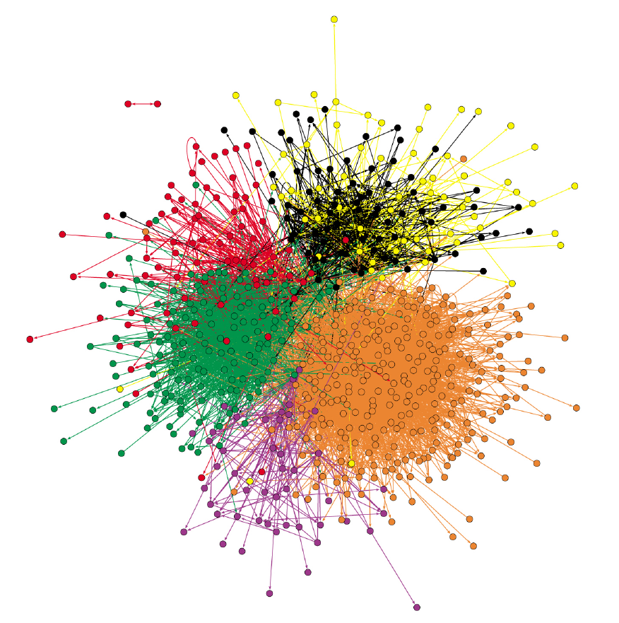]

.pull-right[
- Example of social network among German Politicians on Twitter
[from Lietz et al, 2014](http://www.aaai.org/ocs/index.php/ICWSM/ICWSM14/paper/viewPaper/8069)

- Nodes are the Twitter accounts of politicians

- Directed links link a politician that follows another

- Node color corresponds to the party of a politician

- Force-directed layout
]
---

## Predicting the German elections with Twitter
.center[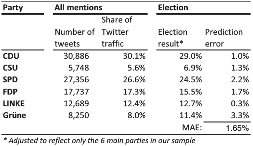]

- German election Twitter prediction, from [Tumasjan et al, 2010](http://www.aaai.org/ocs/index.php/ICWSM/ICWSM10/paper/view/1441)
- Same ranking, prediction errors on average less than 2%! 
- "the mere number of messages reflects the election result and even comes close to traditional election polls". Why are we still using traditional surveys?

---

# The Victory of the Pirate Party

.center[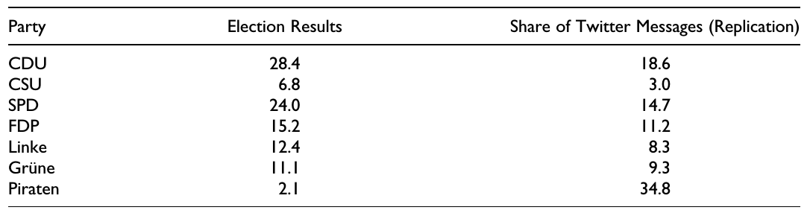]

- Study replication by [Jungherr et al, 2012](https://journals.sagepub.com/doi/abs/10.1177/0894439311404119?journalCode=ssce). 
- Not to judge parties beforehand, they included the Pirate Party too, not just the six most voted parties in the previous election. 
- The Pirate Party would have won by landslide, with almost double the mentions the second party got on Twitter
---

## Comparing original results and replication

```{r echo=F, warning=F, message=F, fig.width=14, fig.height=5, fig.align="center"}
library(ggplot2)
library(patchwork)
df <- read.csv("ElectionPrediction.csv", sep="\t")
g1 <- ggplot(aes(x=Twitter1, y=result), data=df) + geom_point() + geom_text(label=df$Party, hjust = 0, nudge_x = 0.5, size=7) + theme_bw() + xlab("Twitter prediction 1 (%)") + ylab("Election result") + xlim(c(3,35)) + geom_smooth(method = "lm", se = F,col=rgb(0,0,0,0.25)) + theme(text = element_text(size = 30))
g2 <- ggplot(aes(x=Twitter2, y=result), data=df) + geom_point() + geom_text(label=df$Party, hjust = "inward", nudge_x = c(0,rep(0.5,5),-0.5),size=7) + theme_bw() + xlab("Twitter prediction 2 (%)") + ylab("Election result")+ xlim(c(3,35)) + geom_smooth(method = "lm", se = F, col=rgb(0,0,0,0.25))+ theme(text = element_text(size = 30))
g1 + g2
```

Jugherr and colleagues found other issues with the original prediction, for example how small changes in the dates considered for the analysis had a dramatic impact on the results.

---
# Who uses Twitter?
.pull-left[
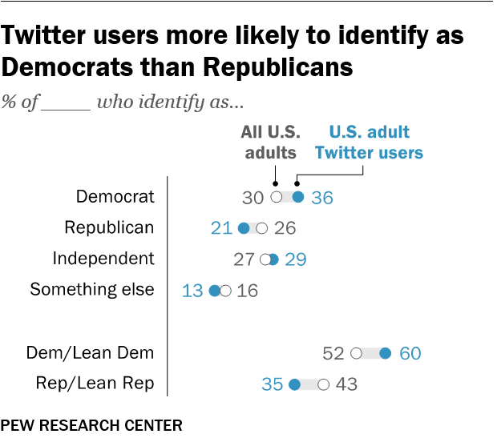]
.pull-right[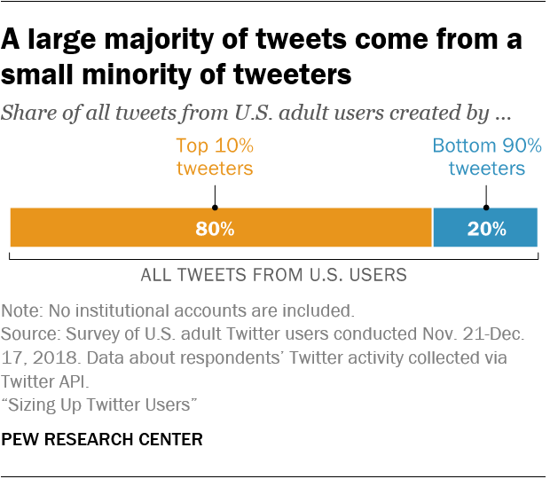]

[Pew Internet Research survey data from 2018](https://www.pewresearch.org/fact-tank/2019/08/02/10-facts-about-americans-and-twitter/)
---

## Can we predict election results with Twitter?
.center[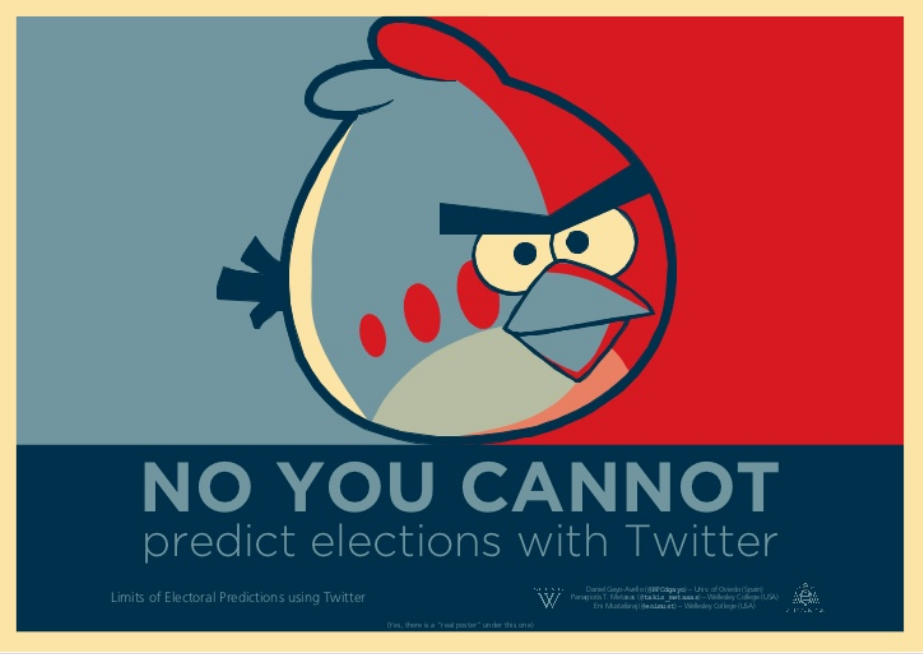  
by Daniel Gayo-Avello  
**Estimating public opinion through tweets suffers self-selection bias**
]


---

# Friendship and social comparison

<div style="float:right">
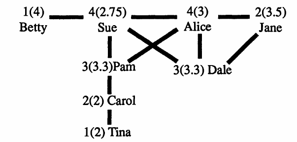  
</div>

- **five** girls have fewer friends than the average of their friends (Betty, Jane, Pam, Dale, Tina), two have more friends  
- **two** have more friends than the average of their friends (Sue and Alice)  
- **one** has as many friends as the average of her friends (Carol)  

Most girls will think that they have less friends than the norm! If we average all numbers, the average number of friends is **2.5** and the average number of friends of friends is **2.99**. 

---

# The Friendship paradox

> **The Friendship Paradox**:
The fact that most people have less friends than the average number of friends of their friends

.center[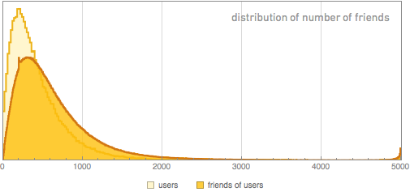]  

---

# The class size paradox

.center[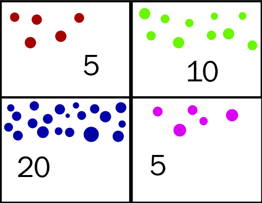]

---

# Random sampling

.center[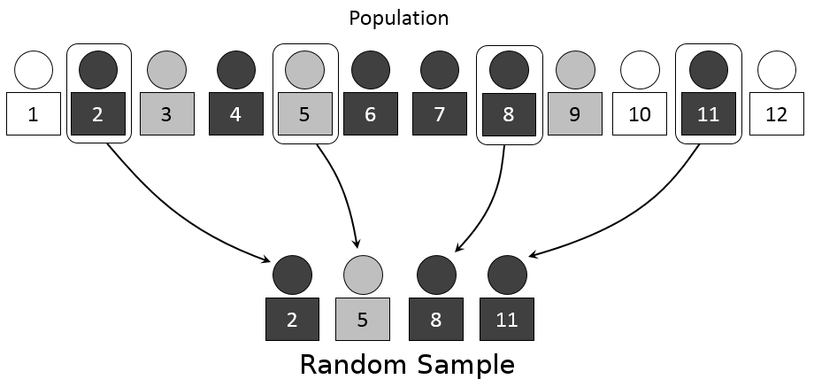]

---

# Stratified sampling 

.center[]

---

# Self-selection bias

.center[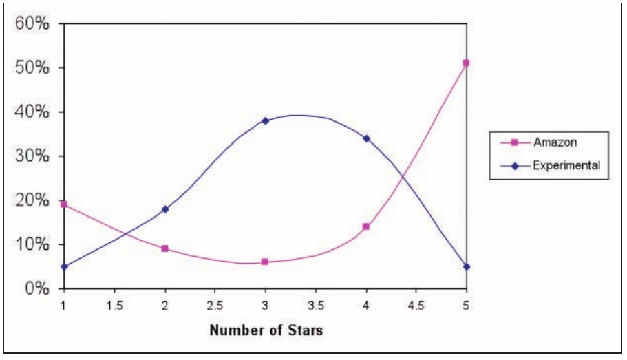]

---

.center[]


